<!--

author:   Sebastian Zug & Georg Jäger
email:    sebastian.zug@informatik.tu-freiberg.de & Georg.Jaeger@informatik.tu-freiberg.de
version:  0.0.1
language: de
narrator: Deutsch Female

import: https://github.com/liascript/CodeRunner
        https://raw.githubusercontent.com/liascript-templates/plantUML/master/README.md

-->

# Sensoren

Eine interaktive Version des Kurses finden Sie unter [Link](https://liascript.github.io/course/?https://raw.githubusercontent.com/SebastianZug/SoftwareprojektRobotik/master/09_Sensoren.md)

**Zielstellung der heutigen Veranstaltung**

+ Typen von Sensoren in mobilen Robotern
+ Integration unter ROS

--------------------------------------------------------------------------------

## Einordnung

Wie weit sind wir bisher gekommen? Dank ROSn können wir beliebige Knoten in unterschiedlichen
Funktionen entwerfen und miteinander verknüpfen. Welche Elemente brauchen wir aber und wie verknüpfen wir diese?


<!--
style="width: 70%; max-width: 720px; display: block; margin-left: auto; margin-right: auto;"
-->
```ascii
                       +----------------------+
                       | Handlungsplanung     |   Strategie
                       +----------------------+
                                ^ ^ ^
                                | | |                  
                                v v v
                       +----------------------+
                       | Ausführung           |   Taktik
                       +----------------------+
                                ^ ^ ^
                                | | |
                                v v v
                       +----------------------+
                       | Reaktive Überwachung |   Ausführung
                       +----------------------+
 Sensordatenerfassung    ^ ^ ^          | | |    
 Aktuatoroperationen     | | |          v v v     
                       .-----------------------.
                       | Umgebung              |
                       .-----------------------.                               .
```

Im weiteren Verlauf der Veranstaltung werden wir uns auf den letzte Ebene fokussieren
und die elementare Verarbeitungskette verschiedener Sensorsysteme analysieren.

<!--
style="width: 70%; max-width: 7200px; display: block; margin-left: auto; margin-right: auto;"
-->
```ascii

       +----------+        +----------+                                
     +-+--------+ |     +--+--------+ |     +----------+     +----------+
+--> |Sensorik  +-+ --> | Filterung +-+ --> | Regelung | --> | Aktorik  | ---+
|    +----------+       +-----------+       +----------+     +----------+    |
|                                                                            |
|                              .---------------------.                       |
+----------------------------- | Umgebung            | <---------------------+
                               .---------------------.
```
Beginnen wir also mit der Sensorik ...

### Sensorik des Menschen

__Aufgabe:__ 	Gewinnung von Information über internen („Propriozeption“) 	bzw. externen Zustand  („Exterozeption“)  = „Wahrnehmung“ von 	Eigenzustand und Umwelt;

__Zielstellung:__ Möglichkeit zur Reaktion auf innere und äußere Einflüsse


| Klassifikation | Umsetzung                                  |
| -------------- | ------------------------------------------ |
| Modalitäten    | + Sehen, Hören, Riechen, Schmecken, Fühlen |
|                | + Temperatur, Gleichgewicht                |
|                | + Hunger, Durst                            |
| Qualitäten     | + rot, grün, blau                          |
|                | + süß, sauer, salzig, bitter               |
|                | + ungefähr 7 Grundgerüche                  |
| Intensität     | Amplitude                                  |

Und wie funktioniert das? Sogenannten Rezeptoren ...

... sind spezialisierte Zellen, die von bestimmten inneren oder äußeren Reizen angeregt werden und sie dann in Form von elektrischen Impulsen oder chemischen Reaktionen weiterleiten.

.. ein ausreichend starker Reiz bewirkt eine Veränderung des Membranpotentials (Generatorpotential)

... lösen ab einer gewissen Intensität des Reizes ein Schmerzempfinden aus.

| Rezeptoren        | Reiz                    |
| ----------------- | ----------------------- |
| Mechanorezeptoren | mechanische Deformation |
| Thermorezeptoren  | Temperaturänderung      |
| Photorezeptoren   | Licht                   |
| Chemorezeptoren   | Geschmäcker und Gerüche |

### Technische Sensoren


    {{0-1}}
*******************************************************************************

> Sensoren (lateinisch „fühlen“ ) transformieren physikalische, chemische oder biologische Messgrößen in elektrische Signale und stellen damit das unmittelbare Interface eines Messsystems zur Umgebung dar.

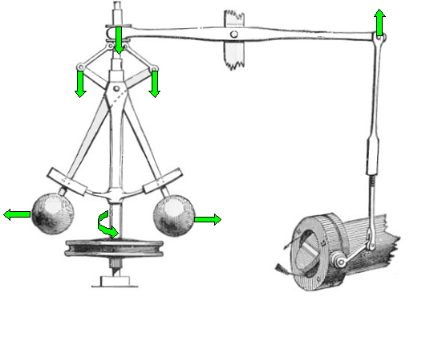<!--style="width: 50%; max-width: 720px;"--> [^1]

[^1]: Fliehkraftregler als Beispiel für die nicht elektrische Ausgabe von Messungen (Drehzahl) [Wikipedia Commons, Nutzer: Kino]

Achtung, die einschlägige deutsche Norm DIN 1319 1-4 vermeidet den Begriff und spricht stattdessen in Abschnitt 2 vom „Messaufnehmer“ als dem Beginn der Messkette. Entsprechend ist die Abgrenzung des eingentlichen Sensorbegriffes auch domainspezifisch und individuell unterschiedlich.
*******************************************************************************


    {{1-2}}
*******************************************************************************

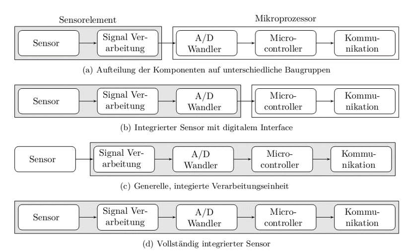<!--style="width: 50%; max-width: 720px;"--> [^2]

[^2]: Integrationsstufen von Sensoren

*******************************************************************************

    {{2-3}}
*******************************************************************************
__Klassifikation von Sensoren__

+ intern/extern ... bezogen auf den Messgegenstand (Radencoder vs. Kamera)
+ aktiv/passiv () ... mit und ohne Beeinflussung der Umgebung (Ultraschall vs. Kamera)
+ Ergebnisdimension ... 1, 2, 2.5, 3D
+ Modalitäten ... physikalische Messgröße

<!--
style="width: 80%; max-width: 720; display: block; margin-left: auto; margin-right: auto;"
-->
```ascii

                Sensoren
                   |
      +------------+--------------+
      |                           |
 interne Sensoren         externe Sensoren
                                  |
               +------------------+----------+
               |                             |
            taktil                     berührungslos
                                             |
                          +------------+-----+-------+---------+
                          |            |             |         |
                      akustisch     optisch     bildbasiert   ....             .
```

*******************************************************************************

    {{3-4}}
*******************************************************************************
Parameter eines Sensors

| Parameter                     | Bedeutung                                                                                                                |
| ----------------------------- | ------------------------------------------------------------------------------------------------------------------------ |
| Messbereich                   | Ausdehnung erfassbaren physikalischen Messgröße (DIN 1319)                                                               |
| Auflösung                     | Vermögen physikalische Größen zu trennen und definiert über Granularitäten in Bezug auf Winkel, Entfernungen, Pixel usw. |
| Linearität                    | Abbildungsverhalten in Bezug auf den Zusammenhang zwischen Eingangsgröße und Ausgabewert. Im linearen Fall gilt $y=mx+n$ |
| Meßfrequenz                   | Häufigkeit der Abtastung                                                                                                 |
| Querempfindlichkeit           | Abhängigkeit der Ausgabe von weiteren Parametern als der eigentlichen Messgröße                                          |
| Ausgabeprotokoll              | Ausgabeschnittstelle für die weitere Verarbeitung                                                                        |
| Öffnungswinkel                | Erfassungsbereich des Sensors bei gerichteter Datenerfassung                                                             |
| Energieaufnahme, Bauraum, ... |                                                                                                                          |

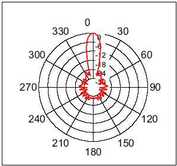<!-- width="40%" -->
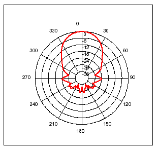<!-- width="40%" --> [^3]

[^3]: Sensorkeulen verschiedener Ultraschallsensoren [robot electronics faq](https://www.robot-electronics.co.uk/htm/sonar_faq.htm)

Hinweis: Die Dämpfung eines Signals wird in "dB" angegeben und mittels $L = 20 · log(\frac{U_2}{U_1})$ beschrieben.  

Auf die Aspekte der Sensorfehler wird in der nächstfolgenden Veranstaltung eingegangen.

*******************************************************************************

## Inertialsensorik

Ein Trägheitsnavigationssystem ermöglicht die Messung der Bewegungen über insgesamt sechs kinematische Freiheitsgrade. Über die physikalischen Beziehungen (Trägheits- und Impulsgesetze) der Größen

+ Kraft,
+ Beschleunigung,
+ Winkelgeschwindigkeit (Drehrate),
+ Geschwindigkeit

werden Positionsaussagen bestimmt. Hauptvorteil ist die Unabhängig von jeglichen Ortungssignalen aus der Umgebung ist.

### Beschleunigungssensoren

__Funktionsprinzip__

| Prinzip                                  | Sensor                                                                                                                                                                                                                                                                                                                |
| ---------------------------------------- | --------------------------------------------------------------------------------------------------------------------------------------------------------------------------------------------------------------------------------------------------------------------------------------------------------------------- |
| Dehnungsmesstreifen                      | ... Bestimmung der Kraft auf die Testmasse, indem die Verformung der Befestigung (z. B. eines Stabes) mittels Dehnungsmessstreifen bestimmt wird.                                                                                                                                                                     |
| Piezoelektrische Beschleunigungssensoren | ... ein piezokeramisches Sensorplättchen wandelt Druckschwankungen in elektrische Signale um. Die Druckschwankung wird durch eine an der Piezokeramik befestigte (seismische) Masse erzeugt und wirkt bei einer Beschleunigung des Gesamtsystems auf die Piezokeramik.                                                |
| Mikro-elektro-mechanische Systeme (MEMS) | Feder-Masse-Systeme, bei denen die „Federn“ nur wenige μm breite Silicium-Stege sind und auch die Masse aus Silicium hergestellt ist. Durch die Auslenkung bei Beschleunigung kann zwischen dem gefedert aufgehängten Teil und einer festen Bezugselektrode eine Änderung der elektrischen Kapazität gemessen werden. |

Konzentrieren wir uns auf das letztgenannte Konzept.

<iframe width="560" height="315" src="https://www.youtube.com/embed/eqZgxR6eRjo" frameborder="0" allow="accelerometer; autoplay; clipboard-write; encrypted-media; gyroscope; picture-in-picture" allowfullscreen></iframe>

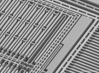<!-- style="width: 33%;"--> [^4]

[^4]: *MEMS - Micro-Electro-Mechanical Systems* [Elektronik Kompendium](http://www.elektronik-kompendium.de/sites/bau/1503041.htm )]

<!--style="width: 70%; max-width: 720px;"-->
*Handbuch MPU 9255* [InvenSense](https://stanford.edu/class/ee267/misc/MPU-9255-Datasheet.pdf)  ]

__Beispiel: Bewegung eines Fahrstuhles__

Aus den Samples des Beschleunigungssensors lässt sich mittels $v=v_0 +\sum a_i\cdot t_i$ die Geschwindigkeit des Fahrstuhles bestimmen.

<!--style="width: 30%; max-width: 720px;"-->
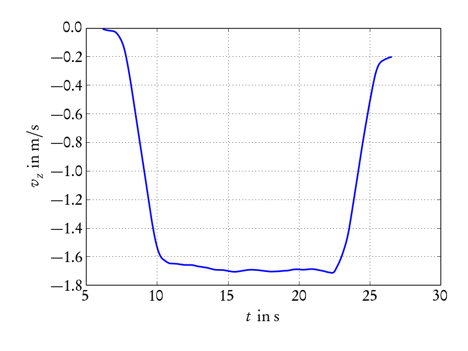<!--style="width: 30%; max-width: 720px;"-->
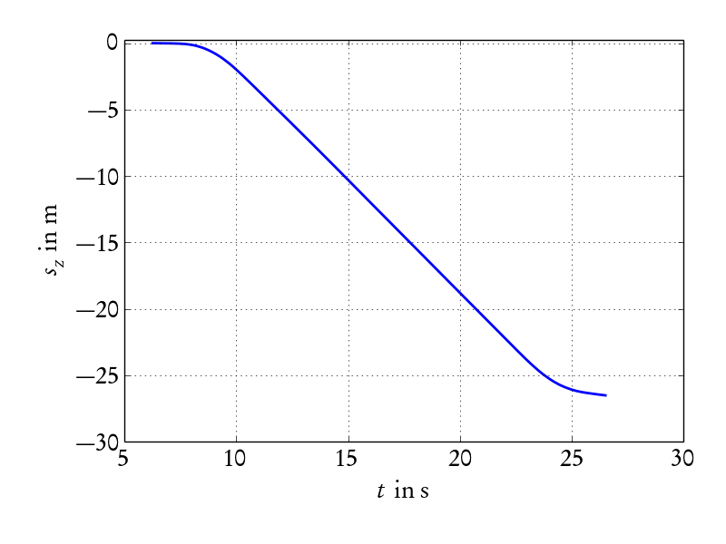<!--style="width: 30%; max-width: 720px;"-->
*Aufzeichung einer Fahrstuhlfahrt mit der IMU des Mobiltelefones* [Jordi Kling, [Zurückgelegter Weg einer Fahrstuhlfahrt mit Handysensorik](https://blogs.hu-berlin.de/didaktikdigital/2016/11/20/zurckgelegter-weg-einer-fahrstuhlfahrt-mit-handysensorik/)  ]

Aus der "Integration" der Samples über der Zeit folgt eine mangelnde Langzeitstabilität, daher koppelt man ein INS beispielsweise liefert eine Kombination mit einem Global Positioning System (GPS).

### Gyroskope

Drehraten-Sensoren messen die Rotationsgeschwindigkeit eines Körpers. Durch Integration lässt sich daraus ableiten, um welchen Winkel sich ein Körper innerhalb einer Zeit gedreht hat. Die Drehraten um die drei Raumachsen bezeichnet man meist als

+ Gierrate (Drehung um Hochachse, engl. yaw)
+ Nickrate (Drehung um Querachse, engl. pitch)
+ Rollrate (Drehung um Längsachse, engl. roll)

Wie kann man das Ganze anwenden?

<iframe width="560" height="315" src="https://www.youtube.com/embed/s_V3mGRaxK0?start=10&end=26" frameborder="0" allow="accelerometer; autoplay; encrypted-media; gyroscope; picture-in-picture" allowfullscreen></iframe>

### Kompasssensoren

Das Erdmagnetfeld wird seit 1800 Jahren zur Orientierung verwendet. Der Kompass wird in Europa erstmals im 13. Jahrhundert erwähnt.

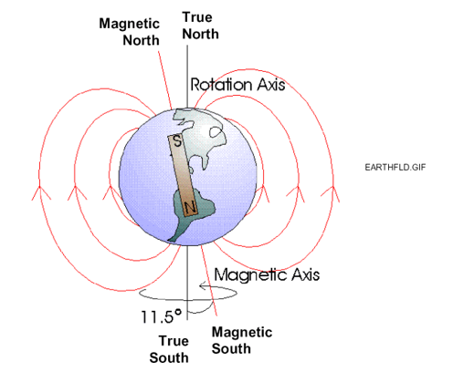<!--style="width: 70%; max-width: 720px;"-->

Die Abweichung zwischen geografischem und magnetischem Pol beträgt für Dresden im Januar 2021 ca. 4,1° in westliche Richtung.

Den Missweisungsrechner des GFZ Potsdam finden Sie unter [Link](http://www-app3.gfz-potsdam.de/Declinationcalc/declinationcalc.html)

__Messprinzip__

Magnetfeldsensoren beruhen auf Wirkungen des magnetischen Feldes in hart- oder weichmagnetischen Werkstoffen, Halbleitern, ultradünnen Schichten, Lichtleitern, Flüssigkeiten oder deren Oberflächen.

| Prinzip         | Sensor                                                                                                                                                                                                                      |
| --------------- | --------------------------------------------------------------------------------------------------------------------------------------------------------------------------------------------------------------------------- |
| Hall-basiert    | ... evaluiert die elektrischen Spannung in einem stromdurchflossenen Leiter, der sich in einem Magnetfeld befindet. Die Spannung fällt dabei senkrecht sowohl zur Stromfluss- als auch zur Magnetfeldrichtung am Leiter ab. |
| Magnetoresistiv | ... basierend auf dem magnetoresistiven Effekt ändert sich der Widerstand eines Leiters, sofern er von einem Magnetfeld umgeben ist.                                                                                        |

Letztgenanntes Messprinzip basiert auf den 1857 von Lord Kelvin beschriebenen magnetoresistiven Effekt.

$R = R_0 \cdot (1 + \frac{\Delta R}{R}\cdot cos^2 \alpha)$

Der elektrische Widerstand hängt von der Ausrichtung $\alpha$ einer ferromagnetischen Dünnschichtlegierung innerhalb eines äußeren Magnetfeldes ab. In der Regel kommen dafür gemischte Legierungen zum Einsatz, beispielsweise Eisen und Nickel. Die Sensoren sind ausgesprochen klein.

**Magnetoresistiver Sensor**

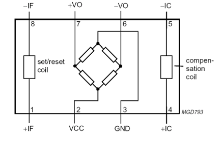<!--style="width: 30%; max-width: 720px;"-->
*Interne Struktur eines KMZ52 Sensors* [Honeywell Electronics 1996](https://asset.conrad.com/media10/add/160267/c1/-/en/000182826DS02/datenblatt-182826-nxp-semiconductors-magnetfeldsensor-kmz-51-5-vdc-messbereich-02-02-kam-so-8-loeten.pdf)  ]

**Hall Sensor**

<iframe width="560" height="315" src="https://www.youtube.com/embed/pIpOqr74XWA" frameborder="0" allow="accelerometer; autoplay; clipboard-write; encrypted-media; gyroscope; picture-in-picture" allowfullscreen></iframe>

> Achtung: Insbesondere bei Innenraumanwendungen unterliegen Kompasse starken Störungen.

<!-- width="60%" -->
*Klassen von Störungen für Kompasssensoren* [Philips Electronic Compass Designusing KMZ51 and KMZ52](https://pdfs.semanticscholar.org/ad20/e5c06b4524fdef0f1dee5b83641822abd609.pdf)  

<!-- width="60%" -->
*Robotersystem mit einem Array von Magnetfeldsensoren zur Datenerfassung* [Dissertation Filip Filipow]

<!-- width="60%" -->
*Flächige Aufnahme der Richtungsinformationen des Magnetfeldes* [Dissertation Filip Filipow]

### Odometrie

Wie erfassen wir die Position eines rotierenden Elements, zum Beispiel eines Motors, um davon auf die Bewegung zu schließen?

+ Schleifdrähte (unterschiedliche Leitfähigkeit)
+ magnetische Sensoren (Nord-Südpol-Wechsel)
+ photoelektrische Abtastung
+ induktive System mit entsprechenden Triggern (zum Beispiel größeres Zahnrad)

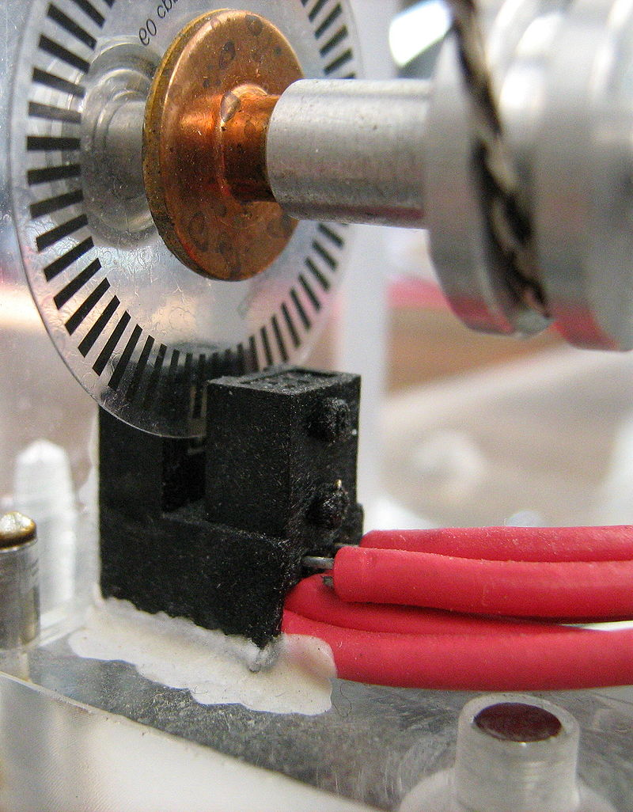<!--style="width: 30%; max-width: 720px;"-->[^2]

[^2]: *Encoder mit Gabellichtschranke* [Wikipedia Commons, Autor Tycho](https://commons.wikimedia.org/w/index.php?curid=4955638)

Die Zahl der Zustands-/Flankenwechsel pro Zeiteinheit ist direkt proportional zur Rotationsgeschwindigkeit.

        {{1}}
********************************************************************************
__Inkrementelle Kodierung:__ zur Bestimmung der relativen Lage/Drehgeschwindigkeit anhand einer Impulsfolge,
Abwägung der Impulszahl pro Drehung von der

+ Leistungsfähigkeit der Auswertehardware
+ Drehzahlen
+ Störgrößen

moderne Drehimpulsgeber kleiner Bauform haben bis zu 6000 Segmente Aufbau üblicherweise vor dem Getriebe.

__Absolute Kodierung:__  Lageermittlung gegenüber einem Fixpunkt, aufwendige Drehimpulsgeber bis hunderttausenden Impulsen pro Umdrehung, häufigste Codierung: Gray-Code (nur auf einem Ausgangssignal findet eine Signaländerung)

Ein inkrementeller Encoder kann durch eine externe Beschaltung als absolute Kodierung genutzt werden. Über einen Nullschalter, wird ein Zähler resetet, der dann im Treiber die aktuelle Position durch Dekrementierung oder Inkrementierung bestimmt.

********************************************************************************

           {{2}}
********************************************************************************

Das Konzept eines einfachen Einkanal-Drehimpulsgeber (nur 1 Bit (Hell - Dunkel Übergang)) wird in der Praxis in zwei Richtungen erweitert:

1. Die Integration einer weiteren Spur, des Nullindex erweitert die Fehlertoleranz. Er ist auf dem Umlauf nur einmal aktiv. Der Nullindex kann zur Definition eines Schaltpunktes, zur Zählung der Umdrehungen oder zur Synchronisation eines nachgeschalteten elektronischenZählers eingesetzt werden.

2. Zweikanal-Drehimpulsgeber erweitern das Konzept mit einem weiteren optischen Schrankensysteme, das um 90 Grad phasenverschoben ist. Damit kann sowohl die Drehrichtung, als auch eine Vervielfachung der Impulse realisiert werden.

<!--
style="width: 80%; max-width: 700px; display: block; margin-left: auto; margin-right: auto;"
-->
```ascii

          ^           90°
          |         |<--->|
          |      +-----+     +------
Kanal A   |      |     |     |
          | -----+     +-----+
          |
          | --+     +-----+     +----
Kanal B   |   |     |     |     |
          |   +-----+     +-----+
          |                                   +----+
Pulsver-  | --+  +--+  +--+  +--+        A ---| =1 |--- P2
dopplung  |   |  |  |  |  |  |  |        B ---|    |
          |   +--+  +--+  +--+                +----+
          +--------------------------->       
```
********************************************************************************

## Entfernungsmessung

Entfernungen lassen sich unabhängig von der Modalität mit vier grundlegenden Verfahren erfassen.

+ Amplitudenbasiert
+ Laufzeitbasiert
+ Phasenbasiert oder
+ Trigonometisch

### Amplitudenmessung

Die Größe eines Messsignals wird als Indikator für die Entfernung zum Objekt genutzt.

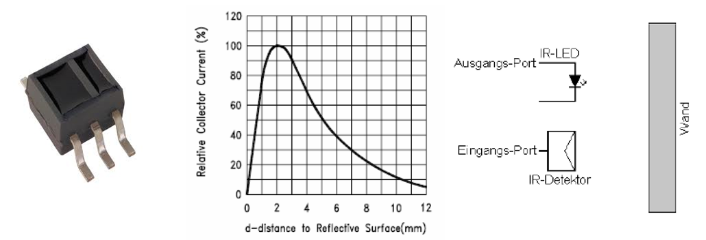<!--style="width: 90%; max-width: 720px;"-->

*Infrarot Distanzsensor auf Reflexionsbasis* [AVAGO Technologies, APDS 9103 Sensor](http://www.produktinfo.conrad.com/datenblaetter/125000-149999/140269-da-01-en-IR_SENSOR_APDS_9103_L22.pdf)

Analoge Konzepte finden sich auch für berührungslose Schalter auf kapazitiver Basis.

Nachteile:

+ Starke Abhängigkeit des Ausgabewertes vom Objekt und der Umgebungssituation
+ Totbereich

### Laufzeitmessung

{{0-1}}
********************************************************************************

Das Laufzeitverfahren basiert auf der Messung des Zeitversatzes zwischen dem Aussenden eines Impulses und dem Empfang von dessen Reflexion.

<!--
style="width: 80%; max-width: 700px; display: block; margin-left: auto; margin-right: auto;"
-->
```ascii

          ^       
          |      +-----+   
          |      |     |
Sender    |      |     |     
          | -----+     +-----+
          |     Sendeimpuls
          |              
          |      |<------------->| Δt Laufzeit der ersten Echoantwort
          |
          |                      .-----.     2. Echo
          |                      |     |   .---.
Empfänger |   | Störungen   |    |     |   |   |
          | --+-------------+----.     .---.   .-----------
          +--------------------------------------------------->               .
                                  Zeit      
```

Prominentestes Beispiel für Laufzeitsensoren sind ultraschallbasierte Systeme.

Aussenden eines Schallimpulses und Messung der Laufzeit des Echos
Entfernung (in m) 𝑑 =1/2  𝑐 𝑡 aus Laufzeit t (in s) des
Übliche Frequenzen: 40kHz bis 200kHz

**Herausforderung 1: Identifikation des Impulses**

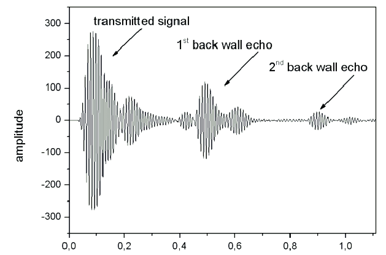<!--style="width: 70%; max-width: 720px;"--> [^3]

[^3]: *Sendeimpuls und Echo eines Ultraschallsensors* aus G. Schober et al., Degree of Dispersion Monitoring by Ultrasonic Transmission Technique and Excitation of the Transducer's Harmonics, [Link](https://www.researchgate.net/publication/264385266_Degree_of_Dispersion_Monitoring_by_Ultrasonic_Transmission_Technique_and_Excitation_of_the_Transducer%27s_Harmonics)

**Herausforderung 2: Querabhängigkeiten**

Neben den Reflexionsmechanismen sind auch die Ausbreitungsparameter des Schallimpulses von der Umgebung abhängig.
Die Schallgeschwindigkeit ist abhänig von

+ Temperatur
+ Luftdruck
+ Luftzusammensetzung (Anteil von CO$_2$, Luftfeuchte)

<!--style="width: 70%; max-width: 720px;"-->
*Schallgeschwindigkeit in Abhängigkeit von der Temperatur und dem Luftdruck*

Welchen Einfluß haben diese Größen? Für zwei Konfigurationen, die zwei unterschiedliche
Wetterlagen repräsentieren ergibt sich bereits ein Fehler von 8%.

$v_1 (980 hPa, 0°) = 325\frac{m}{s}$

$v_2 (1040 hPa, 30°) = 355\frac{m}{s}$

********************************************************************************

    {{1-2}}
********************************************************************************

Das Konzept lässt sich aber auch auf höherfrequente Signale (Licht, Radar) übertragen. Mit der höheren Frequenz sinkt die Dämpfung in der Luft. Damit lassen sich dann größere Reichweiten umsetzen.

TOF-Kameras (englisch: time of flight) verwendeten PMD (Photonic Mixing Device)-Sensor, die Szenen mittels eines Lichtpulses ausleuchten. Die Kamera misst für jeden Bildpunkt die Zeit, die das Licht bis zum Objekt und wieder zurück braucht. Die benötigte Zeit ist direkt proportional zur Distanz. Für 2.5 Meter bedeutet dies eine Zeitdauer von:

$$
t_D= 2 \cdot \frac{D}{c} = \frac{2.5m}{300.000.000 m/s} = 16.66 ns (!)
$$

Für einen 50ns breiten Impuls bedeutet dies, dass die maximale Distanz

$$
D_{max}= \frac{1}{2} \cdot c \cdot t_0 = 7.5m
$$

Allerdings sind die Systeme in starkem Maße von der Hintergrundbeleuchtung abhängig. Trotz Filtern stören irreguläre Beleuchtungsanteile die Messung. Eine Lösungsmöglichkeit ist die redundante Messung über zwei phasenverschobene Elemente. Im Bild werden zwei Speicherelemente S1 und S2 durch zwei Schalter G1 und G2 aktiviert. S1 integriert die Spannung über dem Photosensitiven Element auf, bis die Aussendung abgeschlossen ist. Danach wird G2 aktiviert und S2 zeichnet den verbleibenen Impulsanteil auf. Der Distanzwert ergibt sich zu:

$$
D= \frac{1}{2} \cdot c \cdot t_0 \cdot \frac{S2}{S1 + S2}
$$

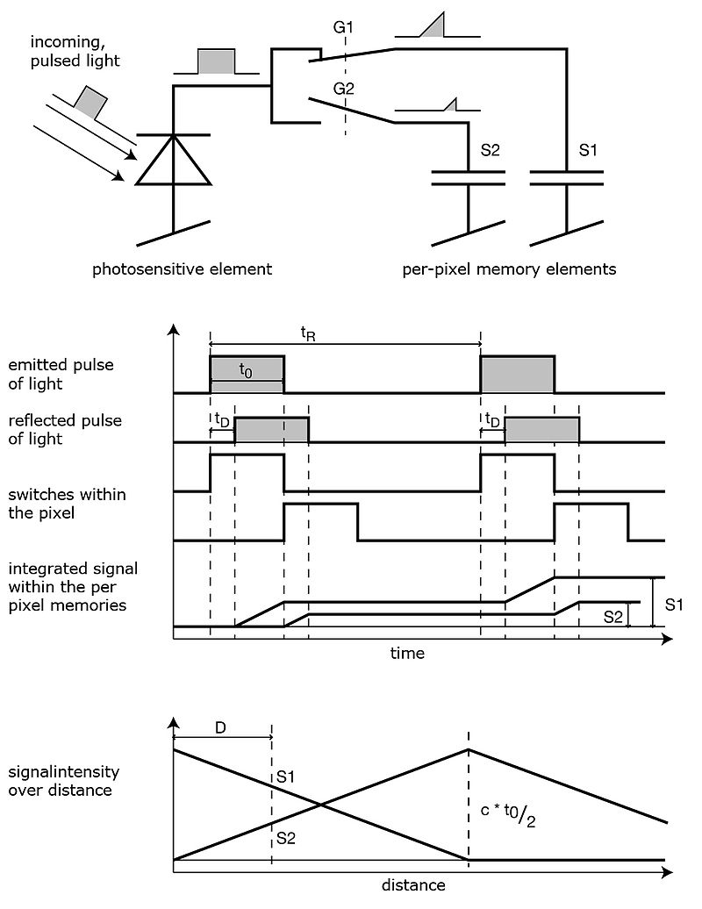<!--style="width: 70%; max-width: 720px;"-->[^4]

[^4]: *Schematische Darstellung der Funktionalität eines TOF Pixels* [Wikimedia Commons, Autor Captaindistance](https://de.wikipedia.org/wiki/TOF-Kamera#/media/Datei:TOF-Kamera-Prinzip.jpg)

Die Kamera liefert somit für jeden Bildpunkt die Entfernung des darauf abgebildeten Objektes. Das Prinzip entspricht dem Laserscanning mit dem Vorteil, dass eine ganze Szene auf einmal aufgenommen wird und nicht abgetastet werden muss.

| Vorteile                                                   | Nachteile                    |
| ---------------------------------------------------------- | ---------------------------- |
| Einfacher Aufbau ohne bewegliche Teile (vgl. Laserscanner) | Einfluß von Hintergrundlicht |
| Synchrones Abbildungsverhalten                             | Gegenseitige Störung         |
| Musterunabhängigkeit (vgl. Stereokameras)                  | Mehrfachreflexionen          |


********************************************************************************

### Phasenverschiebung

Die Phasenverschiebung des reflektierten Laserstrahls oder dessen Modulation gegenüber dem ausgesandten Strahl ist entfernungsabhängig.

<!--style="width: 70%; max-width: 720px;"-->[^5]

[^5]: *Phasenverschiebung zwischen einem ausgesandten und dem empfangenen Signal* [Wikimedia Commons, Autor Guy Muller ](https://de.wikipedia.org/wiki/Elektrooptische_Entfernungsmessung#/media/Datei:PhasenModulation.JPG)

Der zentrale Nachteil des Verfahrens besteht darin, dass die Messung des Phasenunterschieds oberhalb einer Phasendifferenz von mehr als 360 Grad wegen des periodischen Charakters keine eindeutige Aussage zum Abstand mehr zulässt.

$c=f\cdot \lambda$ für $f = 5 Mhz$ ergibt sich eine Wellenlänge von 60m.

Eine Lösung besteht darin verschiedene Frequenzen unterschiedlicher Wellenlänge durchzuschalten und durch logische Vergleiche der Messwerte eine große Reichweite und zudem eine hohe Genauigkeit erreichen.

### Triangulation

Triangulationsverfahren setzen auf einem bekannten Abstand zwischen von Empfänger und Sender auf. Die sogenannte *Baseline* ist dann Ausgangspunkt für die Bestimmung des Abstandes. An dieser Stelle seien zwei Beispiele gezeigt:

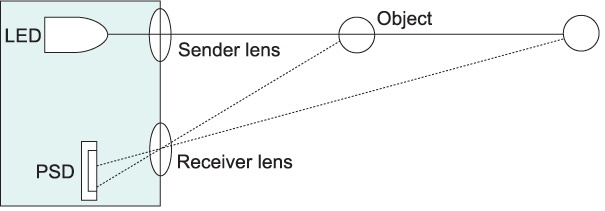<!-- width="80%" -->
*Funktionsweise eines einfachen IR-Distanzsensors nach dem Triangulationsprinzip [Link](http://www.symmons.com/Press-Room/News/2010/november/S-6060-sensor-faucet.aspx)*

Anwendung findet dieses Konzept auch bei RGB-D Kameras, sowohl bei Infrarotbasierten Systemen als auch bei Stereokameras.


## Exkurs - Vorteile des Infrarotspektrums

+ Fremdlichtunabhängigkeit
+ Diodenspezifika
+ Nicht sichtbar

<!-- width="60%" -->
*Spektrum der Strahlungsintensität* [Wikipedia Commons](https://commons.wikimedia.org/wiki/File:Sonne_Strahlungsintensitaet.svg)


## Beispielanwendung - Ultraschall

Als Anwendungsbeispiel sollen die grundlegenden Herausforderungen anhand zweier Sensoren verdeutlicht werden:

| Sensor           | HC-SR04     | GP2D12           |
| ---------------- | ----------- | ---------------- |
| Modalität        | Ultraschall | Infrarotes Licht |
| Funktionsprinzip | Laufzeit    | Trigonometrie    |
| Reichweite       | 400cm       | 10-80cm          |
| Schnittstelle    | Digital     | Analog           |

Diese spezifischen Sensortypen spielen, obwohl die Reichweiten mit bis zu 400cm für den Ultraschallsensor angegeben werden nur in der unmittelbaren Nahfeldüberwachung eine Rolle. Häufig werden sie aber durch Laserscanner ersetzt.

Die Messdaten beider Sensoren werden über einen Mikrocontroller erfasst und mit einem ROS-spezifischen Protokoll (rosserial) über die serielle Schnittstelle kommuniziert. Rosserial eröffnet die Möglichkeit Publish/Subscribe Methoden auch mit Geräten ohne Ethernetverbindung "nachzubilden".

Entfernungen werden unter ROS als `sensor_msgs/Range.msg` dargestellt.

> ROS handhabt die Messdaten für die Länge, Masse, Zeit und den Strom in SI Einheiten. In einigen Fällen weicht man davon ab (Temperaturangaben in Grad Celsius) ! [Link](https://www.ros.org/reps/rep-0103.html)

```
Header header           # timestamp in the header is the time the ranger
                        # returned the distance reading

# Radiation type enums
# If you want a value added to this list, send an email to the ros-users list
uint8 ULTRASOUND=0
uint8 INFRARED=1

uint8 radiation_type    # the type of radiation used by the sensor
                        # (sound, IR, etc) [enum]

float32 field_of_view   # the size of the arc that the distance reading is
                        # valid for [rad]
                        # the object causing the range reading may have
                        # been anywhere within -field_of_view/2 and
                        # field_of_view/2 at the measured range.
                        # 0 angle corresponds to the x-axis of the sensor.

float32 min_range       # minimum range value [m]
float32 max_range       # maximum range value [m]
                        # Fixed distance rangers require min_range==max_range

float32 range           # range data [m]
                        # (Note: values < range_min or > range_max
                        # should be discarded)
                        # Fixed distance rangers only output -Inf or +Inf.
                        # -Inf represents a detection within fixed distance.
                        # (Detection too close to the sensor to quantify)
                        # +Inf represents no detection within the fixed distance.
                        # (Object out of range)
```

<!--
style="width: 100%; max-width: 700px; display: block; margin-left: auto; margin-right: auto;"
-->
```ascii                                      
   .                                          !                            .-,(  ),-.
   |\+--------+    +----------+  USB Serielle ! +-----------+ ROS       .-(          )-.
   | | Sensor |----| Arduino  |---------------!-| rosserial |----------(    ROS         )-
   |/+--------+    +----------+  Verbindung   ! +-----------+ Messages  '-(          ).-'
   .                                          !                            '-.( ).-'

```

Starten Sie `rosserial` mit

```
rosrun rosserial_python serial_node.py /dev/ttyACM0
```

Das Programm für den Arduino-Knoten stellt sich wie folgt dar:


```c++    ReadUSValue.ino
#define USE_USBCON

#include <ros.h>
#include <ros/time.h>
#include <sensor_msgs/Range.h>
#include <sensor_msgs/Imu.h>

ros::NodeHandle  nh;

sensor_msgs::Range range_msg;
sensor_msgs::Imu imu_msg;

ros::Publisher pub_range( "range_data", &range_msg);

const int trigger_pin = 6;
const int echo_pin    = 7;
unsigned long range_timer;

char frameid[] = "/us_ranger";

// 333 m/s = 33300 cm/s = 33.300 cm/ms = 0.0333 cm/mus
const float sonic_speed = 0.0333;

unsigned long getDuration(int tPin,int ePin){
  // Run-time measurment between activation of tPin and ePin
  // Used for ultrasonic measurements here.
  // returns Duration in [ns]
  digitalWrite(tPin, LOW);  // Reset the trigger pin.
  delayMicroseconds(2);
  digitalWrite(tPin, HIGH);  // Start a measurement.
  delayMicroseconds(10); //
  digitalWrite(tPin, LOW);   // Complete the pulse.
  // https://www.arduino.cc/reference/de/language/functions/advanced-io/pulsein/
  return pulseIn(ePin, HIGH);  // Wait for a reflection pulse [ms]
}

void setup()
{
  nh.initNode();
  nh.advertise(pub_range);

  range_msg.radiation_type = sensor_msgs::Range::ULTRASOUND;
  range_msg.header.frame_id =  frameid;
  range_msg.field_of_view = 0.03;
  range_msg.min_range = 0.03;
  range_msg.max_range = 1.0;

  pinMode(trigger_pin, OUTPUT);
  pinMode(echo_pin, INPUT);
}

void loop()
{
  // publish the range value every 50 milliseconds
  //   since it takes that long for the sensor to stabilize
  if ( (millis()-range_timer) > 50){
    long duration = getDuration(trigger_pin, echo_pin);
    range_msg.range = (float)duration/2*sonic_speed;
    range_msg.header.stamp = nh.now();
    pub_range.publish(&range_msg);
    range_timer =  millis() + 50;
  }
  nh.spinOnce();
}
```

## Beispielanwendung - Kinect

Die Kinect I arbeitet mit einem Infrarotbasierten Trigoniometrieverfahren. Dazu wird ein pseudo-zufälliges Muster auf den Hintergrund geworfen und mit einem Referenzsystem verglichen.

```
roslaunch openni2_launch openni2.launch
```

Dieses Muster kann mit dem zugehörigen Topic visualisiert werden.

<!-- width="100%" -->
*Spektrum der Strahlungsintensität*


## Aufgabe der Woche

+ Die Messdaten der Distanzsensoren wurden in einem Bag-File aufgezeichnet, dass sich im Projektordner unter Examples findet. Starten Sie den Importer für ROS1 Bag-Files und visualisieren Sie den Signalverlauf. Schreiben Sie einen Knoten, der die eingehenden Messwerte anhand eines Schwellwertes prüft und ggf. einen Signalton erzeugt, wenn dieser unterschritten wurde.
